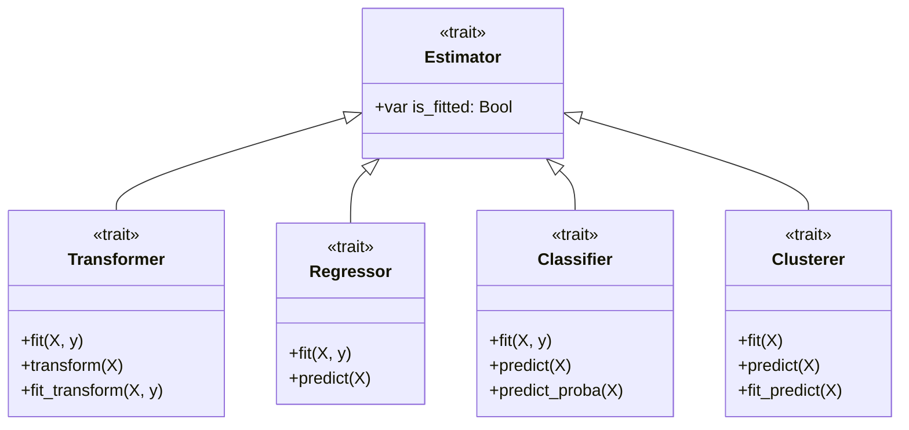

# Estimator Traits & Zero-Cost Composition

This document explains Strata's trait hierarchy and how compile-time parametric polymorphism enables type-safe, composable Machine Learning pipelines without runtime overhead.


---

## 1. The Trait Hierarchy

Strata structures its Machine Learning interfaces around four fundamental traits:



---

## 2. Compile-Time Generics vs Runtime Virtual Tables

In languages like C++ or Python, polymorphism typically uses virtual method tables (`vtable`) or dynamic method lookup. This prevents loop vectorization and function inlining across pipeline stages.

In Strata, pipelines are generic structs parameterizing the exact concrete types:

```mojo
struct PipelineRegressor[
    TransformerT: Transformer,
    RegressorT: Regressor,
    target_dtype: DType
](Copyable, Movable, Regressor):
    var transformer: TransformerT
    var regressor: RegressorT
```

### Compiler Optimization:
Because `TransformerT` and `RegressorT` are known at compile time, the Mojo compiler directly inlines `transformer.transform(X)` and `regressor.predict(X_trans)` into a unified execution stream.
